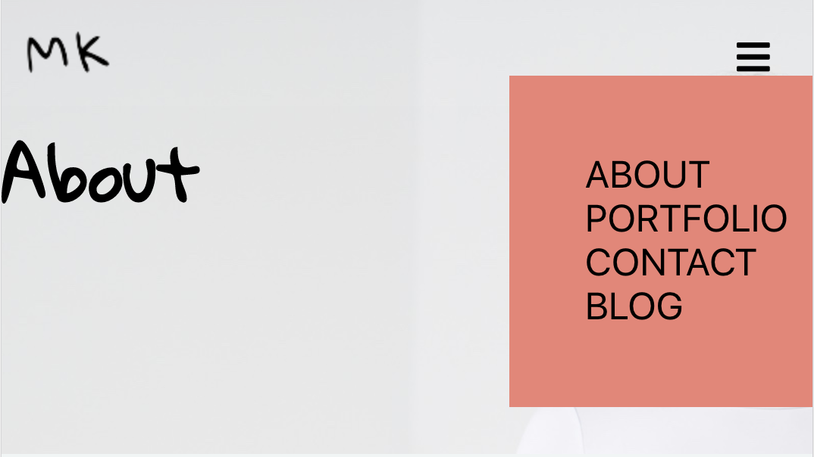
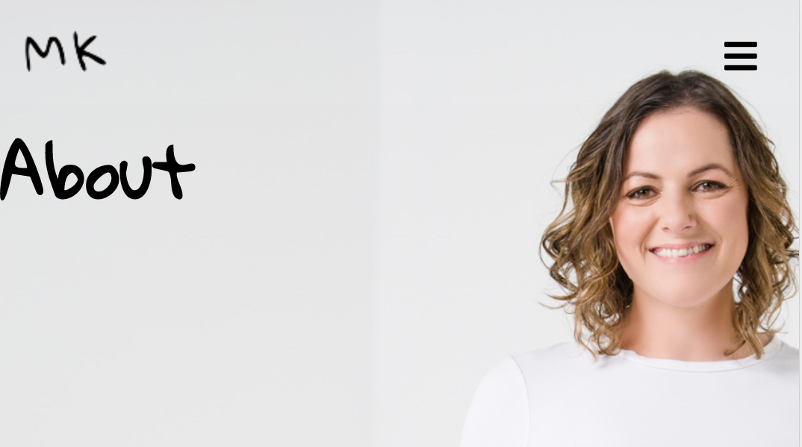
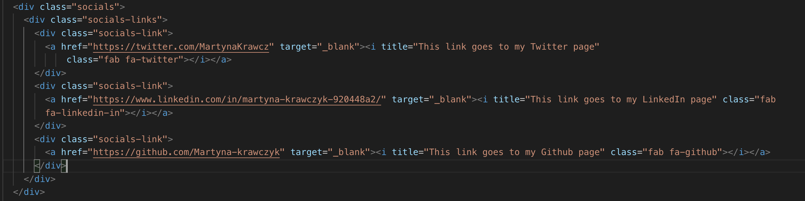

# Martyna Krawczyk Portfolio Website
The portfolio can be found using the below link:
https://martyna-krawczyk.com/

Files can be accessed via Github link below:
https://github.com/Martyna-krawczyk/portfolio

## Purpose
This portfolio website has been created to consolidate access to web and programming projects which I have completed both during the Fast Track course, as well as in the past. It is in itself, also an example of my HTML and CSS skills.  The target audience would likely be future employers in the dev industry.  I wanted the design to look clean, but not sterile and was inspired by many designs on dribble.

## Tech Stack
- HTML
- CSS
- Netlify
- Formspree

### Features
Most pages of the website display a header with a background image, with the exception of the Blog.  All pages also include a navigation bar, social links block as well as footer which I will describe in more detail below:

The website is composed of the five below pages:
1. Home
2. About
3. Portfolio
4. Contact
5. Blog

## Sitemap
[sitemap](https://drive.google.com/file/d/1jnuNX-BoirilCbV3VpF_eBpN6T8EpLd4/view?usp=sharing)

In order of appearance, please find some of the pages' functionalities below:

#### Home
The home page includes a summary of what I am up to now, as well as a flexbox containing links to other pages.  The page has media queries to handle the wrapping of the boxes to the narrower page-width and does this seamlessly thanks to the container width adjustment on each card. The cards also have a hover transformation with a slight scale-up.

#### About
Under the header section is a short text paragraph about me, followed by a link to download my resume (as a direct download). This page also contains a timeline outlining my past experience.  The timeline took significant work - particularly in making it responsive - I was introduced to new concepts including the pseudocodes :nthchild and :before :after whilst building this element.

#### Portfolio
The portfolio section of the website contains five card-style elements (flex-box), each containing images of each respective project as well as links to their sources.

#### Contact
This page contains a form, styled to the page, and thanks to Formspree (https://formspree.io/), will email me all submitted form field content.

#### Blog
The blog doesn't contain the header - instead it contains five [almost] page-width cards which are also responsive. The cards also have a hover transformation with a slight scale-up.
The blog cards contain meta data such as author, date and tags, though these link to the current page, however therre is a Read More>> tag which sends the reader to the original LinkedIn article I have written.

## Navigation
The nav bar at the top of each page was particularly challenging as it was clear that I needed an hamburger menu on the smaller-width media queries.  Once I had the code ready to go, I needed to make changes to the css so that on media query, the hamburger menu would become visible and the top menu links would hide, and vice-versa. The inclusion of the responsive navbar meant that much of my header section content was displaced and this required further rectification.  The navbar now responds to different screen sizes nicely.

### Responsive Navigation Screenshots

## Axe

## HTML Validation

## Design Variations

